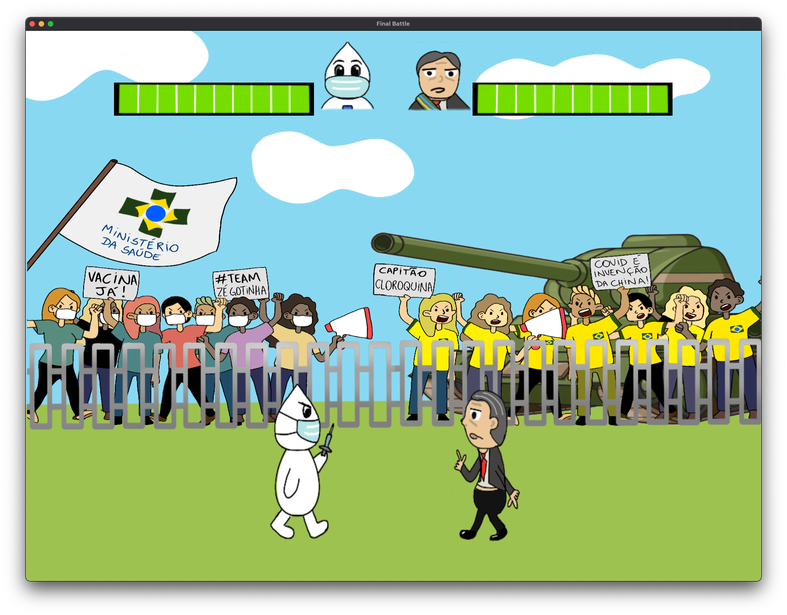

# Call of Butantan: Corona Warfare

Are you ready for the next generation of gaming? Because we are! Introducing the new blockbuster to hit all store shelves in Null Island: **Call of Butantan: Corona Warfare**!

In thie game, you play an epic multiplayer battle between Joseph Little Drop (also known as Zé Gotinha) and the clown Bozo (also known as Jair Bolsonaro) for the control over vaccination, all this while an inspiring soundtrack plays in the background.



Call of Butantan: Corona Warfare supports all major PC operating systems (MacOS and Linux), with other versions coming soon for Xbox Series X and Playstation 5.

## Compiling

A Makefile is supported, which automatically identifies all `.cpp` and `.c` files
inside `/dev/src`. All you need to do in order to compile this masterpiece of 
gaming is run:

```bash
$ cd dev
$ make
``` 

You can also clean the generated binaries by running:

```bash
$ cd dev
$ make clean
```
